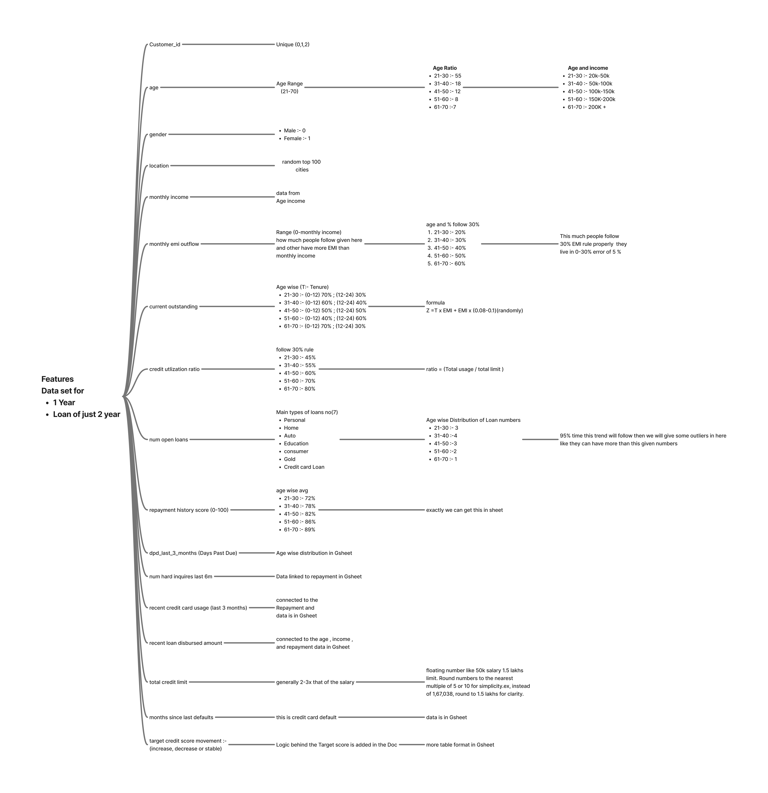

# Credit Score Movement Prediction Project

## Overview
This project is part of the ML Intern hiring process for Jupiter’s President’s Office - Strategic Projects (Bangalore). The objective is to **simulate a realistic synthetic dataset** with 25,000 rows representing customer credit behavior and **build a machine learning model** to predict whether a customer’s credit score will **increase**, **decrease**, or **remain stable** over the next 3 months. The project is divided into two main parts: dataset creation and model training/evaluation, with an optional bonus for proposing interventions.

This README provides an overview of the project, details the logic and assumptions behind the synthetic dataset generation (Part 1), and outlines the approach for Part 2 (to be updated with provided details). It also includes business takeaways and submission details.

## Part 1: Synthetic Dataset Creation
The synthetic dataset simulates realistic credit behavior for 25,000 unique customers, with each row representing a customer-month combination. The dataset includes the following features:


- **customer_id**: Unique identifier (1 to 25,000).
- **age**: Divided into ranges (21-30, 31-40, 41-50, 51-60, 61-70) with probabilities: 55%, 18%, 12%, 8%, and 7%, respectively.
- **gender**: Male or Female.
- **location**: Customers from the top 100 cities in India for diverse geographical representation.
- **monthly_income**: Tied to age groups:
  - 21-30: ₹20k–₹50k
  - 31-40: ₹50k–₹100k
  - 41-50: ₹100k–₹150k
  - 51-60: ₹150k–₹200k
  - 61-70: ₹200k+
- **monthly_emi_outflow**: Calculated as a percentage of monthly income, with 30% of individuals in each age group adhering to the "30% rule" for EMI outflow:
  - 21-30: 20%
  - 31-40: 30%
  - 41-50: 40%
  - 51-60: 50%
  - 61-70: 60%
- **current_outstanding**: Calculated as \( Z = T \times EMI + EMI \times (0.08-0.1) \), where \( T \) is the loan tenure. Short-term loans (1-12 months) are more common in younger age groups, with probabilities:
  - 21-30: 70%
  - 31-40: 60%
  - 41-50: 50%
  - 51-60: 40%
  - 61-70: 40%
- **credit_utilization_ratio**: Assumes individuals follow the 30% credit usage rule, with age-based utilization:
  - 21-30: 45%
  - 31-40: 55%
  - 41-50: 60%
  - 51-60: 70%
  - 61-70: 70%
- **num_open_loans**: Varies by age group, with maximum loans:
  - 21-30: 3
  - 31-40: 4
  - 41-50: 3
  - 51-60: 2
  - 61-70: 1
  Loan types include Personal, Home, Auto, Education, Consumer, Gold, and Credit Card.
- **repayment_history_score**: Ranges from 0-100, distributed by age group:
  - 21-30: 25% Excellent (85-100), 35% Good (70-84), 30% Fair (50-69), 10% Poor (0-49), Avg: 72
  - 31-40: 35% Excellent, 40% Good, 20% Fair, 5% Poor, Avg: 78
  - 41-50: 45% Excellent, 35% Good, 15% Fair, 5% Poor, Avg: 82
  - 51-60: 55% Excellent, 30% Good, 12% Fair, 3% Poor, Avg: 86
  - 61-70: 65% Excellent, 25% Good, 8% Fair, 2% Poor, Avg: 89
- **dpd_last_3_months**: Days Past Due (DPD) by age group:
  - 21-30: 65% DPD 0, 25% DPD 15-30, 10% DPD 60+
  - 31-40: 75% DPD 0, 18% DPD 15-30, 7% DPD 60+
  - 41-50: 83% DPD 0, 13% DPD 15-30
  - 51-60: 90% DPD 0, 8% DPD 15-30
  - 61-70: 95% DPD 0, 4% DPD 15-30
- **num_hard_inquiries_last_6m**: Not fully detailed in slides (Page 10 incomplete), but assumed to follow a distribution based on age and credit behavior.
- **recent_credit_card_usage**: Last 3 months, by age and repayment score:
  - 21-30: 10-25% (Excellent), 20-35% (Good), 30-50% (Fair), 50-80% (Poor)
  - 31-40: 8-20% (Excellent), 15-30% (Good), 25-45% (Fair), 40-75% (Poor)
  - 41-50: 5-15% (Excellent), 10-25% (Good), 20-40% (Fair), 35-65% (Poor)
  - 51-60: 3-12% (Excellent), 8-20% (Good), 15-30% (Fair), 25-50% (Poor)
  - 61-70: 2-10% (Excellent), 5-15% (Good), 10-25% (Fair), 15-35% (Poor)
- **recent_loan_disbursed_amount**: Varies by age and repayment score:
  - 21-30: ₹2-5L (Excellent), ₹1-3L (Good), ₹0.5-2L (Fair), ₹0-0.5L (Poor)
  - 31-40: ₹5-12L (Excellent), ₹2-7L (Good), ₹1-4L (Fair), ₹0-1L (Poor)
  - 41-50: ₹10-18L (Excellent), ₹5-12L (Good), ₹2-6L (Fair), ₹0-2L (Poor)
  - 51-60: ₹8-15L (Excellent), ₹4-10L (Good), ₹1-5L (Fair), ₹0-1L (Poor)
  - 61-70: ₹5-10L (Excellent), ₹2-6L (Good), ₹0.5-3L (Fair), ₹0-0.5L (Poor)
- **total_credit_limit**: Typically 2-3 times monthly income, rounded to the nearest ₹10,000 (e.g., ₹50,000 income → ₹1,00,000–₹1,50,000 limit).
- **months_since_last_default**: By age group:
  - 21-30: 70% Never Defaulted, 12% 0-6m, 10% 6-24m, 8% 24+m, Avg: 18m
  - 31-40: 75% Never Defaulted, 8% 0-6m, 9% 6-24m, 8% 24+m, Avg: 22m
  - 41-50: 82% Never Defaulted, 5% 0-6m, 7% 6-24m, 6% 24+m, Avg: 28m
  - 51-60: 88% Never Defaulted, 3% 0-6m, 5% 6-24m, 4% 24+m, Avg: 35m
  - 61-70: 92% Never Defaulted, 2% 0-6m, 3% 6-24m, 3% 24+m, Avg: 42m
- **target_credit_score_movement**: Determined by balancing positive and negative indicators:
  - **Negative Indicators** (Decrease): High DPD, recent default (<3m), high credit utilization, multiple hard inquiries, low repayment score, high EMI-to-income ratio, high recent loan disbursed amount, high credit card usage.
  - **Positive Indicators** (Increase): On-time payments (DPD 0), long recovery period (>24m since default), low credit utilization, few/no hard inquiries, high repayment score, low EMI-to-income ratio, low recent loan disbursed amount, low credit card usage.
  - **Outcome Logic**:
    - **Decrease**: 4+ negative indicators.
    - **Increase**: 4+ positive indicators.
    - **Stable**: Neither criteria met.

### Assumptions
- **Demographic Distribution**: Age distribution reflects a realistic population pyramid, with younger groups (21-30) being the largest segment.
- **Income and Credit Behavior**: Income increases with age, influencing credit limits, loan amounts, and repayment behavior. Younger customers have higher default rates and lower repayment scores due to lower income and financial inexperience.
- **Loan Tenure and EMI**: Short-term loans dominate younger age groups, with EMI outflow tied to income and age-specific financial discipline.
- **Credit Utilization**: Younger customers have higher utilization due to impulsive spending or financial stress, while older customers are more conservative.
- **Geographical Diversity**: Customers are from India’s top 100 cities to ensure representativeness.
- **Rounding for Simplicity**: Credit limits are rounded to the nearest ₹10,000 for ease of use.

## Part 2: Model Training and Evaluation

### Data Preprocessing and Model Setup
- The dataset was split into **features (`X`)** and **target (`y`)**.
- **SMOTE** (Synthetic Minority Over-sampling Technique) was applied to address class imbalance in the target variable.

### Models
The following models were used for classification to predict the `target_credit_score_movement`:
- **RandomForest**: Random Forest Classifier
- **XGBoost**: XGBoost Classifier
- **LogisticRegression**: Logistic Regression Classifier
- **LightGBM**: LightGBM Classifier

### Hyperparameter Tuning
Grid search was applied to find the best hyperparameters for each model using `GridSearchCV`. The hyperparameters tuned for each model are as follows:
- **RandomForest**:
  - `n_estimators`
  - `max_depth`
  - `min_samples_split`
  - `min_samples_leaf`
  
- **XGBoost**:
  - `n_estimators`: 
  - `max_depth`: 
  - `learning_rate`: 
  - `subsample`: 
- **LogisticRegression**:
  - `C`: 
  - `solver`: 
  
- **LightGBM**:
  - `n_estimators`: 
  - `learning_rate`: 
  - `num_leaves`: 

### K-Fold Cross-Validation
**K-fold cross-validation** (with 5 splits) was used to assess the generalization of the models. The data was split into 5 folds, and for each fold:
1. A model was trained on 4 of the folds.
2. The model was tested on the remaining fold.
3. Evaluation metrics like **accuracy**, **F1-score**, and **recall** were calculated for each fold.

### Model Evaluation Metrics
The following evaluation metrics were calculated:
- **Accuracy**: The proportion of correct predictions.
- **F1-Score**: A balanced measure that combines precision and recall.
- **Class-wise Recall**: Recall score for each class (Increase, Decrease, Stable).

The models' performance was evaluated on the test set, and the following results were reported for each model.

---

### Model Performance

The final evaluation metrics for each model on the test set are as follows:

- **LightGBM**  
  **Accuracy** = 0.961,  
  **F1-Score** = 0.9617

- **XGBoost**  
  **Accuracy** = 0.951,  
  **F1-Score** = 0.9520

- **RandomForest**  
  **Accuracy** = 0.926,  
  **F1-Score** = 0.9285

- **LogisticRegression**  
  **Accuracy** = 0.663,  
  **F1-Score** = 0.6999

---

## SHAP Analysis: Feature Impact

**SHAP** (SHapley Additive exPlanations) was used to interpret the predictions of the models. Below are the key insights derived from SHAP analysis for each model.

### Decrease in Credit Score:
The following features were most important in predicting a **decrease** in credit score:

1. **`credit_utilization_ratio`**: Higher credit utilization significantly increases the likelihood of a decrease in credit score.
2. **`dpd_last_3_months`**: More days past due (dpd) directly correlate with a decrease in credit score.
3. **`num_hard_inquiries_last_6m`**: Increased hard inquiries are a strong indicator that the credit score may decrease.
4. **Other Important Features**:
   - **`monthly_income`**
   - **`monthly_emi_outflow`**
   - **`repayment_history_score`**
   - **`total_credit_limit`**
   - **`recent_loan_disbursed_amount`**
   - **`recent_credit_card_usage`**
   - **`months_since_last_default`**

### Stable Credit Score:
The key features for predicting a **stable** credit score were:

1. **`num_hard_inquiries_last_6m`**: A relatively low number of hard inquiries helps maintain a stable score.
2. **`repayment_history_score`**: A solid repayment history is a strong indicator of a stable credit score.
3. **`total_credit_limit`**: A higher total credit limit is associated with a more stable credit score.
4. **Other Important Features**:
   - **`credit_utilization_ratio`**
   - **`months_since_last_default`**
   - **`recent_loan_disbursed_amount`**
   - **`dpd_last_3_months`**
   - **`gender_encoded`**
   - **`monthly_emi_outflow`**
   - **`monthly_income`**

### Increase in Credit Score:
The most significant features for predicting an **increase** in credit score were:

1. **`num_hard_inquiries_last_6m`**: A lower number of recent hard inquiries is positively correlated with an increase in credit score.
2. **`credit_utilization_ratio`**: A lower credit utilization ratio is strongly associated with an increase in credit score.
3. **`dpd_last_3_months`**: Fewer days past due (dpd) suggests a higher probability of the credit score increasing.
4. **Other Important Features**:
   - **`monthly_emi_outflow`**
   - **`monthly_income`**
   - **`months_since_last_default`**
   - **`recent_credit_card_usage`**
   - **`recent_loan_disbursed_amount`**
   - **`repayment_history_score`**

---

### Conclusion
These **SHAP insights** help us better understand the factors that influence the movement of a customer’s credit score. The information gained from SHAP can be used to guide future decisions related to **risk management**, **rewards programs**, or **targeted interventions** aimed at improving credit health.

By analyzing the SHAP values, we can clearly identify which features are most impactful for each potential outcome and tailor strategies to address specific areas for improvement in a customer’s credit profile.

## Bonus: Product/Policy Interventions

Based on the insights derived from the machine learning models and the SHAP feature importance analysis, we can propose targeted interventions for both **high-risk** and **high-opportunity** customer segments. These interventions aim to optimize credit management and provide personalized financial services to improve customer outcomes.

### High-Risk Segments
High-risk customers are those whose credit score is likely to **decrease** or remain **unstable**. These customers show negative indicators such as high **credit utilization ratio**, **high DPD (Days Past Due)**, **recent defaults**, and a **poor repayment history score**.

#### Proposed Interventions:
1. **Financial Counseling**: 
   - Offer personalized financial advice and budgeting assistance to help customers manage their credit utilization and reduce DPD.
   
2. **Credit Limit Reduction**: 
   - For customers with high credit utilization or recent defaults, consider reducing their credit limit to mitigate further financial stress.
   
3. **Prevention of New Credit Issuance**: 
   - Avoid issuing new loans or credit cards to high-risk customers until they show signs of improving their credit behavior.
   
4. **Offer Payment Restructuring**: 
   - For customers with multiple defaults or high outstanding dues, offer payment restructuring options to lower their monthly EMIs and reduce financial strain.
   
5. **Targeted Marketing for Risk Mitigation Products**: 
   - Offer products like **low-interest loans** or **credit card balance transfer options** to customers who are at risk of default.

### High-Opportunity Segments
High-opportunity customers are those whose credit score is likely to **increase**. These customers exhibit positive indicators such as low **credit utilization**, a **good repayment history**, and minimal **DPD**.

#### Proposed Interventions:
1. **Credit Limit Increase**:
   - For customers with low credit utilization and a strong repayment history, offer a **credit limit increase** to encourage responsible borrowing and further boost their credit score.
   
2. **Pre-Approved Loan Offers**:
   - Provide **pre-approved loan offers** to high-opportunity customers, offering them attractive rates and terms as a reward for their good financial behavior.
   
3. **Rewards Programs**:
   - Introduce **rewards programs** for customers with strong credit behavior, offering benefits such as cash-back, points for timely payments, or discounted loan interest rates.
   
4. **Early Loan Refinancing Offers**:
   - For customers with a solid repayment history, provide **early refinancing** options for existing loans to lower their interest rates and reduce repayment burdens.
   
5. **Offer Financial Products with Lower Interest Rates**:
   - Provide customers who are likely to see an increase in their credit score with access to **financial products with lower interest rates**, such as personal loans, home loans, or credit cards.
   
<!-- ### Streamlit & Gemini API Integration
Develop an **interactive dashboard** using **Streamlit** to visualize credit score movements and key risk factors in real time. The dashboard could be integrated with the **Gemini API** to provide:
- **Real-time insights** into customer credit behavior.
- **Dynamic risk and opportunity segmentation** based on the latest available data, allowing for proactive interventions.
- **Personalized recommendations** for both high-risk and high-opportunity customers based on the model’s predictions.

By integrating these targeted interventions, we can optimize credit risk management, enhance customer satisfaction, and increase retention by offering tailored financial services that meet the individual needs of the customers. -->


## Business Takeaways
- **Risk Management**: Identifying customers with multiple negative indicators (e.g., high DPD, recent defaults) allows proactive risk mitigation, reducing potential losses.
- **Customer Segmentation**: Differentiating customers by age, income, and repayment behavior enables tailored product offerings, improving customer satisfaction and retention.
- **Predictive Insights**: The model provides actionable predictions to optimize credit decisions, such as approving loans or adjusting credit limits.
- **Scalability**: The synthetic dataset and model can be adapted to real-world data, supporting Jupiter’s strategic goals in AI-driven decision intelligence.

## Dependencies
- Python 3.x
- Libraries: `pandas`, `numpy`, `sklearn`, `imblearn` (for class imbalance), `shap` or `lime` (for explainability), `streamlit` (for bonus dashboard)
<!-- - Optional: Gemini API for bonus integration -->

## How to Run

Follow these steps to set up and run the Credit Score Movement Prediction project:

1. **Clone the repository or download the submission files**:
   - Clone the repository or download the project files to your local system.

2. **Install dependencies**:
   - Navigate to the project folder and run the following command to install the required libraries:
     ```bash
     pip install -r requirements.txt
     ```

3. **Generate the synthetic dataset**:
   - The first step is to generate the synthetic dataset. Open the `dataGenerator.ipynb` file in Jupyter Notebook and run all the cells to create the dataset. This will generate the `credit_score_dataset.csv` file, which will be used for model training.
   
4. **Train and evaluate the model**:
   - After the dataset is generated, run the `model.ipynb` file in Jupyter Notebook. This will:
     - Load the synthetic dataset.
     - Preprocess the data.
     - Train the models (RandomForest, XGBoost, LogisticRegression, LightGBM).
     - Perform hyperparameter tuning and K-fold cross-validation.
     - Evaluate the models' performance.
     - Save the trained models as joblib pickle files.
   
5. **Run the Streamlit app**:
   - Open and run the `app.py` file to launch the Streamlit UI.
     - The Streamlit app allows you to test the model predictions by inputting different parameters (e.g., age, income, credit utilization, etc.).
     - It provides real-time predictions of the **target_credit_score_movement** (Increase, Decrease, or Stable) based on the provided parameters.
   
   To run the app:
   ```bash
   streamlit run app.py


## Contact
- **Name**: Preet Kodape
- **Email**: preetkodape9430@gmail.com
- **Phone**: 9325447962

